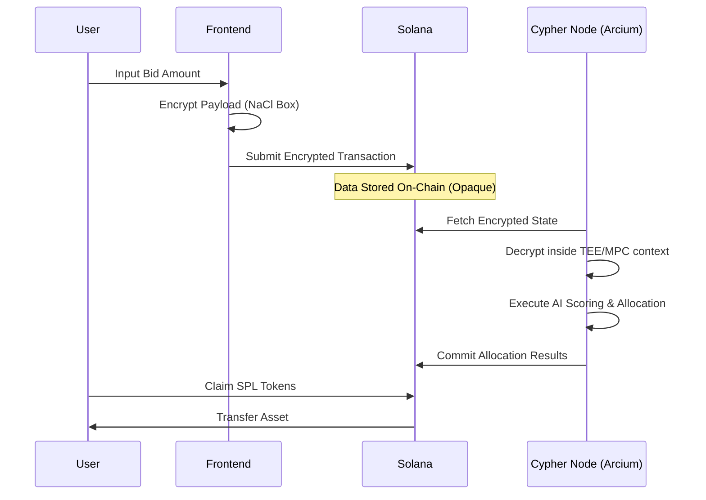

# Obsidian | The Dark Launchpad

**Privacy-Preserving Token Launchpad on Solana powered by Arcium Confidential Computing.**

**Live Application:** [https://obsidian-qdke.vercel.app/](https://obsidian-qdke.vercel.app/)

---

## Executive Summary

Obsidian addresses the critical issue of information leakage in decentralized finance auctions. By integrating Arcium's confidential computing layer with Solana's high-performance blockchain, Obsidian enables "Dark Auctions" where bid amounts remain encrypted until the auction concludes. This mechanism prevents front-running, eliminates price manipulation based on visible demand, and ensures equitable market participation.

## Core Problem

Traditional on-chain launchpads suffer from transparency paradoxes:
*   **Public Bid Visibility:** Large bids signal market sentiment, leading to reactionary bidding.
*   **MEV & Front-running:** Sophisticated actors extract value from pending transactions.
*   **Price Discovery Failures:** Visible order books allow for artificial price anchoring.
*   **Inequitable Allocations:** Small participants are often systematically disadvantaged by whale observation.

## The Solution

Obsidian implements a privacy-first architecture using specific cryptographic primitives:

1.  **Client-Side Encryption:** Bids are encrypted in the browser using the Cypher Node's public key (TweetNaCl asymmetric encryption).
2.  **Confidential Processing:** Encrypted payloads are stored on-chain but remain readable only by the Arcium Multi-Party Computation (MPC) nodes.
3.  **Verifiable Execution:** The Cypher Node decrypts bids within a Trusted Execution Environment (TEE), executes the allocation logic, and posts the results on-chain.
4.  **Zero-Knowledge Principles:** Individual bid amounts are never revealed to the public or the protocol administrators.

### Architecture Overview

## Technical Stack

### Blockchain Infrastructure
*   **Solana:** Layer 1 blockchain for consensus and settlement.
*   **Anchor Framework:** Rust-based smart contract development framework.
*   **SPL Token Program:** Standardized token operations for assets and pools.

### Confidentiality Layer
*   **Arcium Network:** Decentralized confidential computing network.
*   **TweetNaCl:** Cryptographic library for Curve25519-XSalsa20-Poly1305 encryption.
*   **Cypher Node:** Custom TypeScript execution environment for off-chain verifiable compute.

### Frontend Interface
*   **Next.js 15:** React framework for server-side rendering and static generation.
*   **TailwindCSS:** Utility-first CSS framework for design system implementation.
*   **Solana Wallet Adapter:** Standard library for wallet connection and transaction signing.

## System Components

### Solana Program
The core logic resides in `programs/obsidian/src/lib.rs`. It manages:
*   **Launch State:** Initialization of token pools and auction parameters.
*   **Bid Ledger:** Storage of encrypted user bids.
*   **Allocation Registry:** Recording of final token distribution.

### Cypher Node
Located in `scripts/run-cypher-demo.ts`, this component acts as the bridge between on-chain state and confidential processing. Ideally run within a TEE, it handles:
*   Decryption of user bids.
*   Execution of the AI-driven allocation model.
*   Signing of allocation transactions.

## Deployment Information

*   **Program ID:** `8nkjktP5dWDYCkwR3fJFSuQANB1vyw5g5LTHCrxnf3CE`
*   **Network:** Solana Devnet
*   **Frontend URL:** [https://obsidian-qdke.vercel.app/](https://obsidian-qdke.vercel.app/)

## Security Model

The security of Obsidian relies on a hybrid model:
1.  **Transport Security:** Data is encrypted at the client level before transmission.
2.  **Compute Security:** Decryption keys exist only within the Arcium node context.
3.  **State Integrity:** Solana guarantees the immutability of the encrypted ledger and the final allocation record.

## Roadmap

*   [x] **Phase 1:** Encrypted bidding and on-chain storage.
*   [x] **Phase 2:** Off-chain decryption and allocation recording.
*   [x] **Phase 3:** User claim interface and SPL token integration.
*   [ ] **Phase 4:** Full Arcium Network integration (Distributed Key Generation).
*   [ ] **Phase 5:** Token-2022 confidential transfer extensions.
*   [ ] **Phase 6:** DAO governance for parameter selection.

---

*Developed for the Arcium x Solana Hackathon.*
