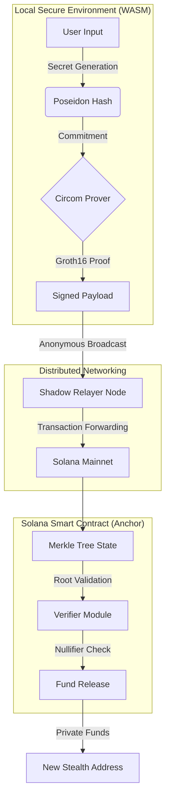

<div align="center">
  <br />
  <pre>
███████╗ ██████╗ ██╗     ██╗   ██╗ ██████╗ ██╗██████╗ 
██╔════╝██╔═══██╗██║     ██║   ██║██╔═══██╗██║██╔══██╗
███████╗██║   ██║██║     ██║   ██║██║   ██║██║██║  ██║
╚════██║██║   ██║██║     ╚██╗ ██╔╝██║   ██║██║██║  ██║
███████║╚██████╔╝███████╗ ╚████╔╝ ╚██████╔╝██║██████╔╝
╚══════╝ ╚═════╝ ╚══════╝  ╚═══╝   ╚═════╝ ╚═╝╚═════╝ 
  </pre>

  <h3><b>SolVoid Protocol: The Enterprise Sovereign Privacy Layer</b></h3>
  <p><i>Next-Generation Zero-Knowledge Privacy Lifecycle Management (PLM) for the Solana Ecosystem</i></p>

  <p>
    <a href="https://github.com/brainless3178/SolVoid/actions"></a>
    <a href="https://codecov.io/gh/brainless3178/SolVoid"></a>
    <a href="https://github.com/brainless3178/SolVoid/releases"></a>
    <a href="./LICENSE"></a>
  </p>
  <p>
    <a href="https://solana.com"></a>
    <a href="./docs"></a>
    <a href="https://github.com/brainless3178/SolVoid/security/advisories"></a>
    <a href="https://discord.gg/solvoid"></a>
  </p>

  <p align="center">
    <strong>SolVoid</strong> is a high-performance, non-custodial privacy protocol that provides a decentralized identity-abstraction layer on the Solana blockchain.
    <br />
    It utilizes <b>Groth16 Zero-Knowledge SNARKs</b> and <b>Poseidon-3 Hashing</b> to deliver institutional-grade anonymity at sub-second speeds.
  </p>
</div>

---

## 🔱 Executive Vision

In the landscape of hyper-transparent blockchain architectures, **SolVoid** represents the critical transition from "Public-by-Default" to "Private-by-Choice." The protocol is engineered to neutralize the risks of on-chain telemetry, MEV-sandwich attacks, and transaction graph heuristics. By decoupling asset ownership from transaction history, SolVoid empowers individuals and institutions to execute sensitive financial maneuvers with the speed of Solana and the secrecy of Zero-Knowledge.

---

## 🧭 Master Table of Contents

1.  [Core Value Propositions](#-core-value-propositions)
2.  [Exhaustive Feature Matrix](#-exhaustive-feature-matrix)
3.  [Deep-Dive Architecture](#-deep-dive-architecture)
    -   [ZK-SNARK Circuit Topology](#zk-snark-circuit-topology)
    -   [The Poseidon-3 Hash Standard](#the-poseidon-3-hash-standard)
    -   [On-Chain State Management](#on-chain-state-management)
4.  [Privacy Ghost Score Diagnostics](#-privacy-ghost-score-diagnostics)
5.  [Command-Line Interface (CLI) Master Reference](#-command-line-interface-cli-master-reference)
6.  [Shadow Relayer Infrastructure](#-shadow-relayer-infrastructure)
7.  [Operational Setup & Lifecycle](#-operational-setup--lifecycle)
8.  [Security, Validation & Testing](#-security-validation--testing)
    -   [The Shell Script Index](#the-shell-script-index)
9.  [Master Strategic Roadmap](#-master-strategic-roadmap)
10. [Repository Directory Blueprint](#-repository-directory-blueprint)
11. [Governance & Strategic Contributions](#-governance--strategic-contributions)
12. [Glossary of Cryptographic Terms](#-glossary-of-cryptographic-terms)

---

## 💎 Core Value Propositions

-   **Unlinkable Anonymity**: Complete decoupling of funding sources from destination wallets via Merkle-tree based shielding.
-   **Hardware-Accelerated Privacy**: Optimized for Solana’s runtime, achieving verification costs below 200,000 Compute Units.
-   **Zero-Knowledge Integrity**: Pure cryptographic proof of ownership without revealing the source deposit (Secret/Nullifier).
-   **Anti-Heuristic Engine**: Native defense against transaction timing and volume analysis via the Ghost Scoring diagnostics.

---

## ✨ Exhaustive Feature Matrix

| Domain | Capability | Technical Detail | Status |
| :--- | :--- | :--- | :---: |
| **Shielding** | **ZK-Commitment Pool** | Fixed-depth (20) Merkle Tree supporting 1M+ deposits. | ✅ |
| **Withdrawal** | **Groth16 Verification** | Sub-600ms proof generation on-device via WASM/SDK. | ✅ |
| **Diagnostics** | **Privacy Ghost Score** | 4-pillar metadata audit (Linkage, Temporal, Volume, Entropy). | ✅ |
| **Infrastructure**| **Shadow Relayer 2.0** | Gasless & IP-anonymous transaction broadcasting. | ✅ |
| **Emergency** | **Atomic Rescue** | <2s scripted migration for compromised private keys. | ✅ |
| **Identity** | **ZK-Signed Badges** | Portable personal privacy credentials without revealing the URI. | ✅ |
| **Scanners** | **Ultimate Privacy Scan** | Resilience suite using 40+ RPCs with IP-rotation. | ✅ |

---

## 🧬 Deep-Dive Architecture

SolVoid is not a single tool, but a synergistic ecosystem of cryptographic primitives and on-chain state managers.



### ZK-SNARK Circuit Topology
Our circuits are written in **Circom 2.1**, employing a Groth16 proving scheme on the **BN254** elliptic curve. This ensures maximum compatibility with Solana's forthcoming ZK precompiles while maintaining current operational efficiency through our custom Rust verifier.

### The Poseidon-3 Hash Standard
We use **Poseidon-3**, a Sponge-construction hash function optimized specifically for R1CS (Rank-1 Constraint Systems). 
-   **Efficiency**: Reduces constraints from ~20,000 (Keccak) to **~210** per field element.
-   **Security**: Provides 128-bit security against all known algebraic attacks.

### On-Chain State Management
The SolVoid program manages a sliding window of **100 Merkle Roots**. This allows users to generate proofs against slightly older state, mitigating the risk of "Root Drift" where a proof becomes invalid because someone else deposited simultaneously.

---

## 👻 Privacy Ghost Score Diagnostics

The **Ghost Score** is the heartbeat of the SolVoid ecosystem. It provides an objective numerical rank (0-100) of your wallet's anonymity.

-   **Linkage Score**: Identifies direct and N-hop paths to centralized exchanges (CEX) or known identifiers.
-   **Temporal Analysis**: Detects "human" rhythms in transaction timing (e.g., repeating daily patterns).
-   **Volume Profiling**: Flagging of round-number deposits (e.g., exactly 10.0 SOL) which are easier to track.

```bash
# Execute deep-scan and generate shareable ZK-signed badge
solvoid-scan ghost <MY_ADDRESS> --badge --share --json
```

---

## 🔧 Command-Line Interface (CLI) Master Reference

The `solvoid-scan` CLI is a production-grade binary for privacy management.

#### Core Operational Commands
-   `solvoid-scan shield <amount>`: The primary ingress. Converts native SOL to a ZK-Commitment.
-   `solvoid-scan withdraw <secret> <nullifier> <recipient> <amount>`: The primary egress. Reclaims funds anonymously.
-   `solvoid-scan ghost <address>`: Generates the Ghost Score report and visual terminal art.
-   `solvoid-scan protect <address>`: Active monitoring mode for identifying real-time privacy leaks.
-   `solvoid-scan rescue <wallet>`: Atomic "nuke" option for high-speed mitigation of key leaks.

#### Protocol Administration
-   `solvoid-scan admin trigger-emergency <mult> <reason>`: Globally scale protocol fees (1x-10x).
-   `solvoid-scan admin disable-emergency`: Restore baseline fee economics.
-   `solvoid-scan admin pause`: Trigger Circuit Breaker to halt all withdrawals.
-   `solvoid-scan admin resume`: Lift Circuit Breaker and resume protocol operations.

#### Global Flags & Automation
| Flag | Description | Default |
| :--- | :--- | :--- |
| `--rpc <URL>` | Override standard Solana RPC endpoints. | Mainnet-Beta |
| `--program <ID>` | Override the default SolVoid Program ID. | `Fg6Pa...` |
| `--relayer <URL>` | Target a specific Shadow Relayer instance. | `http://localhost:3000` |
| `--dry-run` | Perform an atomic simulation without spending gas. | `false` |
| `--json` | Output all results in raw JSON format for CI/CD. | `false` |

---

## 🛰 Shadow Relayer Infrastructure

The **Shadow Relayer** is a critical component for achieving network-level anonymity.

> **TIP**  
> Use the Relayer to avoid "Gas Linkage." If you fund your new recipient wallet with gas from an exchange, you have nullified your privacy. The Relayer solves this by paying the gas for you and deducting a small bounty from the withdrawal.

### Relayer Endpoints
-   `GET /health`: Node status and network metrics.
-   `POST /register`: Onboarding for new relay nodes.
-   `POST /relay`: The primary submission point for ZK-signed transactions.
-   `POST /encrypt-route`: Prepares multi-hop onion-routed payloads.

---

## 🚀 Operational Setup & Lifecycle

### 1. Requirements
- **Node.js**: v18.0.0+ (Recommended: v20 LTS)
- **Rust/Cargo**: 1.75.0+
- **Solana CLI**: Latest Stable
- **Hardware**: AVX2 support (optional, for faster local proving)

### 2. Deployment Flow
```bash
# Clone Enterprise Repository
git clone https://github.com/brainless3178/SolVoid.git
cd solvoid

# Install Critical Dependencies
npm install && npm run build

# Configure Environment
cp .env.example .env
```

### 3. Local Ceremony (Optional)
For highly secure local environments, run a personal MPC ceremony:
```bash
./scripts/run-ceremony.sh
```

---

## 🛡 Security, Validation & Testing

SolVoid employs a "Defense in Depth" strategy, validated by a massive suite of specialized shell scripts in `/scripts`.

### The Shell Script Index
| Script | Documentation |
| :--- | :--- |
| `./scripts/run-security-tests.sh` | **The Master Suite**: Runs every validation mentioned below. |
| `./scripts/verify-hash-consistency.sh` | Confirms Poseidon-3 parity across Rust, TS, and Circom logic. |
| `./scripts/vault-balance-protection.sh` | Simulates "phantom withdrawal" attacks to verify vault safety. |
| `./scripts/nullifier-validation-test.sh` | Verifies the impossibility of double-spending. |
| `./scripts/test-emergency-procedures.sh` | Stress-tests the speed and effectiveness of the Atomic Rescue. |
| `./scripts/arithmetic-safety-test.sh` | Probes for overflows and field-element collisions. |
| `./scripts/rust-dependency-audit.sh` | Performs a deep audit of the cargo dependency tree for CVEs. |

### Testing Lifecycle
```bash
# Run unit tests for SDK and CLI
npm run test:unit

# Run full integration tests with local validator
npm run test:integration

# Execute 100% security validation suite
./scripts/security-validation.sh
```

---

## 🗺 Master Strategic Roadmap

### Phase 1: Foundation (Current Status: ✅ COMPLETED)
- [x] Merkle Tree Core Logic (Depth 20)
- [x] Poseidon-3 Sponge Construction Hashing
- [x] Groth16 Proving Engine (Browser & Node)
- [x] Multi-platform SDK for dApp developers

### Phase 2: Visibility (Current Status: ✅ COMPLETED)
- [x] Privacy Ghost Scoring Diagnostics
- [x] Shadow Relayer Alpha Deployment
- [x] CLI Automation Tools & Binary Releases
- [x] ZK-Signed Privacy Badges

### Phase 3: Expansion (Timeline: Q2 2026)
- [ ] **SPL Token Support**: Shielding for USDC, BONK, and JupSOL.
- [ ] **Decentralized Relayer Incentives**: Governance-managed relayer rewards.
- [ ] **On-chain MPC Ceremony**: Official ceremony for Mainnet-Beta Proving Keys.
- [ ] **Onion Routing**: Layered network anonymity via the Relayer Mesh.

---

## 📂 Repository Directory Blueprint

```text
.
├── programs/           # Anchor-based Solana Smart Contracts (Rust)
├── circuits/           # Circom 2.1 source files & ZK Proving keys
├── sdk/                # TypeScript SDK for frontend & backend integration
├── cli/                # Source code for the solvoid-scan binary
├── relayer/            # Shadow Relayer Node source (Node.js/Express)
├── dashboard/          # Next.js 15 Web interface
├── scripts/            # Over 30+ production shell scripts for DevOps/Security
├── bin/                # Compiled CLI executables
└── docs/               # Technical Specifications & Manuals
```

---

## 🤝 Governance & Strategic Contributions

We welcome contributions from cryptographers, security researchers, and developers.

1.  **Read** the [Security Policy](./SECURITY.md).
2.  **Review** our [Contributing Guidelines][contributing].
3.  **Submit** an issue using the provided templates.
4.  **Open** a Pull Request against the `develop` branch.

---

## 📚 Glossary of Cryptographic Terms

-   **BN254**: The barreto-naehrig elliptic curve used for SNARKs.
-   **R1CS**: Rank-1 Constraint System; the mathematical representation of our circuits.
-   **Nullifier**: A unique serial number for a deposit, kept secret until withdrawal.
-   **Commitment**: The hash of (Secret + Nullifier + Amount), stored on-chain.
-   **Circuit**: A specialized piece of logic that defines what the ZK proof proves.

---

<p align="center">
  <b>Built for the Solana Privacy Hackathon 2026.</b><br />
  SolVoid is an open-source contribution to the global right to financial anonymity.
</p>

<div align="center">
  <a href="#-solvoid-protocol-the-enterprise-sovereign-privacy-layer"><b>↑ BACK TO TOP ↑</b></a>
</div>

[commands-docs]: ./COMMANDS.md
[contributing]: ./CONTRIBUTING.md
