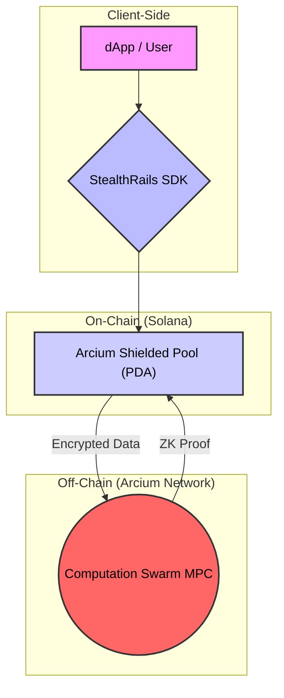

# Stealth Rails 🛡️⚡

**The Universal Privacy Layer for Solana.**

Stealth Rails is a developer-first infrastructure platform that enables **one-click, private-by-default transactions** on Solana. Powered by **Arcium (Confidential Computing)**, we abstract the complexity of Zero-Knowledge Proofs and Multi-Party Computation into a single, easy-to-use SDK.

> **Status**: 🟢 **Live on Devnet** | **Backend**: Real Arcium Network

## 🚀 The Platform

We are not just a wallet. We are the **Stripe for Privacy**.

### 1. The SDK (`@stealth-rails/sdk`)
Add privacy to any dApp in 3 lines of code.
```typescript
import { StealthRails } from '@stealth-rails/sdk';

const rails = new StealthRails(connection, wallet);

// 🛡️ Shield & Transfer in one atomic step (MPC)
await rails.sendPrivate({
  to: "Giw...",
  amount: 10
});
```

### 2. Stealth Pay (`/pay`)
A dedicated "Incognito Mode" for payments. Send a link to get paid privately without revealing your main treasury history.
- **Try it**: Navigate to [`/pay`](http://localhost:3000/pay)

### 3. DeFi Integration (`/dex`)
See how major protocols (like Jupiter) can integrate Stealth Rails.
- **Try it**: Navigate to [`/dex`](http://localhost:3000/dex) and toggle "Shield Output".

---

## 🛠️ Architecture



**Core Components:**
1.  **StealthRails Class**: The main entry point. It manages the connection to the Arcium Reader Node and the Solana RPC.
2.  **Arcium Executing Pool**: A Program-Derived Address (PDA) on Solana that acts as the "Shielded Pool".
3.  **Computation Swarm**: A network of MPC nodes that listen for encrypted inputs and perform validity proofs off-chain.

## 📦 Getting Started

### Prerequisites
- Node.js 18+
- Solana Wallet (Phantom/Backpack) on **Devnet**

### Installation

```bash
# 1. Install Dependencies
cd web
npm install

# 2. Run the Platform
npm run dev
```

## 🏆 Use Cases

1.  **Payroll**: DAOs paying contributors without doxxing their salaries.
2.  **Alpha**: Traders entering positions without being copy-traded.
3.  **Commerce**: Merchants accepting crypto without revealing their total revenue.

---
*Built with ❤️ using Arcium & Solana.*
