# WAVIS Protocol 🛡️

### The First "Compliance-Ready" Shielded Pool on Solana

## 🎥 Demo Video
> **Watch the full walkthrough here:**
> [**▶️ Click to Watch on YouTube**](https://www.youtube.com/watch?v=Rb-UO8K60EY)

---

> **⚠️ Hackathon Status: Architectural Prototype**
>
> This repository demonstrates the **UX**, **Economics**, and **Compliance Architecture** of the WAVIS Protocol.
> While the deposit layer interacts with the Solana Devnet, the ZK verification and Proof-of-Innocence layers are **simulated (mocked)** to demonstrate the user flow without risking funds in unaudited circuits.

---

## 🚨 TL;DR for Judges

* **Problem:** On-chain privacy is usually non-compliant (Money Laundering risk) and hard to use (Bad UX).
* **Solution:** A "Swiss Bank" on Solana that combines **Proof-of-Innocence** (Allowlist) with **Yield-bearing Vaults**.
* **Innovation:** We solved the "Tornado Cash Problem" by proving funds are clean *without* revealing the user's identity.
* **Status:** Deposit is real (Anchor). Compliance check is architectural.

---

## 1. Why WAVIS Exists: "Privacy is Infrastructure"

Most privacy protocols focus on cryptography but neglect **UX** and **Regulation**.
This leads to two outcomes: nobody uses them (too hard), or only hackers use them (get banned).

WAVIS treats privacy as **infrastructure**.

* ⚡️ **Fast:** Built for Solana-speed.
* 💰 **Profitable:** Generates Shadow Yield while shielded.
* ⚖️ **Clean:** Uses Proof of Innocence to stay compliant.

**Our Vision:**
If perfect ZK privacy existed today, how should it feel to use?
It should feel like a bank vault, not a hacker's terminal.

---

## 2. Architecture (The "WAVIS Flow")

We utilize a hybrid architecture: **On-Chain Vaults** for holding assets, and **Client-Side ZK** for privacy and compliance.

### A. The Core Logic (Anchor Program)

Instead of issuing traceable SPL tokens (like wUSDC), WAVIS uses an **Internal Ledger** based on PDAs (Program Derived Addresses).

```rust
// The "Invisible" Ledger
#[account]
pub struct UserVault {
    pub owner: Pubkey,            // Authenticated via Signature (ECIES)
    pub shares: u64,              // Internal balance representation
    pub last_deposit: i64,        // For Yield calculation
    pub nullifier_hash: [u8; 32], // Anti-double-spend mechanism
}

#[account]
pub struct GlobalConfig {
    pub total_shares: u64,
    pub exchange_rate: u64,       // Increases over time (Yield)
    pub compliance_root: [u8; 32],// Merkle Root of Sanctioned Addresses
}
```

B. The Transaction Flow

```mermaid
sequenceDiagram
    participant User as 👤 User
    participant UI as 🖥️ WAVIS Client
    participant Oracle as ⚖️ Compliance Oracle
    participant Vault as 🏛️ Solana Vault

    Note over User, Vault: Phase 1: DEPOSIT (Shield)
    User->>UI: Input 1 SOL
    UI->>Oracle: Check Source Address (Ingress Filtering)
    Oracle-->>UI: OK (Not Sanctioned)
    UI->>Vault: Transfer 1 SOL
    Vault->>Vault: Mint Shares (Internal Ledger)
    
    Note over User, Vault: Phase 2: YIELD (Time Passes)
    Vault->>Vault: Auto-compound (Exchange Rate Goes Up)
    
    Note over User, Vault: Phase 3: WITHDRAW (Unshield)
    User->>UI: Request Withdrawal
    
    rect rgb(20, 20, 20)
        Note right of UI: 🔐 Proof of Innocence (Mocked)
        UI->>UI: Generate ZK Proof:
        UI->>UI: 1. I own the shares
        UI->>UI: 2. My deposit is NOT in the Sanctioned List
    end
    
    UI->>Vault: Submit Proof & Withdrawal Request
    Vault->>Vault: Verify Proof & Burn Shares
    Vault-->>User: Transfer 1.005 SOL (Principal + Yield)
```



## 3. The "Killer Feature": Proof of Innocence ⚖️
This is how WAVIS survives regulation. We implement the Privacy Pools concept (championed by Vitalik Buterin) adapted for Solana.

How it works (The Logic)
Users do not prove "Who they are." They prove "Who they are NOT."

1. Merkle Tree of Sanctions: We maintain an on-chain Merkle Root derived from the OFAC Sanctions List and major hack addresses (fed by Chainalysis/TRM Labs oracles).

2. ZK-Circuit: When withdrawing, the user generates a Zero-Knowledge Proof that asserts:

 "My deposit exists in the vault's history, AND my deposit address is NOT part of the current Sanctions Merkle Tree."

3. Result: The protocol verifies the funds are clean without ever seeing the user's address.

Note: In this Hackathon version (v0.1), the ZK verification is simulated. The UI demonstrates the flow of checking against a mock Allowlist.

## 4. Why Mock the ZK Circuit? (Honesty Statement)
We have chosen to simulate the ZK verification layer for this hackathon. This is a safety boundary, not a shortcut.

* Security: Shipping unaudited ZK circuits puts real user funds at risk.
* Focus: We prioritized solving the UX and Economic Model (Yield) first.
* Cost: Real-time OFAC data integration requires enterprise API keys.

Our goal is to demonstrate the Architecture and User Experience of a production-ready system.

## 5. Implementation Status

| Feature | Hackathon Version (v0.1) | Production Version (v1.0) |
| :--- | :--- | :--- |
| **Vault Logic** | ✅ Real On-Chain (Devnet) | ✅ Real On-Chain (Mainnet) |
| **Deposit/Withdraw** | ✅ Real Anchor Program | ✅ Real Anchor Program |
| **Internal Ledger** | ✅ Implemented (PDA) | ✅ Implemented (Encrypted PDA) |
| **Shadow Yield** | 🚧 Simulated (Rate += 0.001) | 🔄 Live CPI to Save/Kamino |
| **Compliance** | 🚧 Mocked Filter | 🔒 ZK Proof of Innocence |
| **Interface** | ✅ Neo-Swiss Style UI | ✅ Mobile App & SDK |

## 6. Roadmap: Zero to "Swiss Bank"

* Phase 1 (Current): Architectural Prototype. Real Vault, Mocked ZK.
* Phase 2 (Audit): Integrate Light Protocol for compression. Audit the Vault.
* Phase 3 (Compliance): Connect Chainlink Oracle for real-time Sanctions List.
* Phase 4 (Launch): Mainnet launch with "Invited Users Only" (Closed Alpha).

## 🏁 Hackathon Disclaimer
This repository contains mocked components clearly marked as such. No user funds are at risk. This is a design freeze for a future production system.

Built with ❤️ for the Solana Renaissance.


